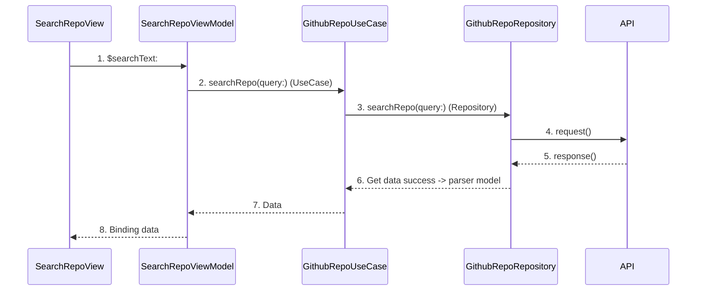

# iOS: Clean Architecture với SwiftUI, Combine và MVVM-C

## Giới thiệu
**Clean Architecture** là một business architecture, nó tách rời những xử lý nghiệp vụ khỏi **UI** và **framework**. Clean Architecture phân rõ vai trò và trách nhiệm của từng layer trong kiến trúc của mình.

## Ưu nhược điểm
Về mặt **ưu điểm**, Clean architecture đạt được:
-   Giúp logic nghiệp vụ trở nên rõ ràng.
-   Không phụ thuộc vào framework
-   Các thành phần UI hoàn toàn tách biệt và độc lập.
-   Không phụ thuộc vào nguồn cung cấp dữ liệu.
-   Dễ dàng unit test.

Về mặt **nhược điểm**:
-   Clean architecture do phân tách cấu trúc thành nhiều tầng nên dẫn đến việc số lượng code sinh ra là rất lớn.

## Các thành phần chính


Về mặt cấu trúc,  **Clean architecture**  gồm 3 thành phần chính:

-   **Domain**: Là tầng chứa các thành phần cơ bản của ứng dụng và những gì ứng dụng có thể làm như các Entity, UseCase,... Nó không phụ thuộc vào bất cứ thành phần nào của UI hay bất kỳ Framework nào và cũng không implement bất kỳ một thành phần nào của ứng dụng tại tầng này.
-   **Platform**: Là tầng triển khai các phần cụ thể (concrete implementation) của tầng `Domain`. Tầng `Platform` sẽ che giấu đi những chi tiết được triển khai thực hiện. Bất cứ các task nào liên quan đến `call api, local DB, backend...` sẽ thực hiện ở đây.
-   **Application (hoặc Presentation)**: Là tầng chịu trách nhiệm cung cấp thông tin từ ứng dụng cho user và tiếp nhận những input từ user cho ứng dụng. Nó có thể được triển khai với các mô hình như MVC, MVP, MVVM. Đối với SwiftUI thì đây sẽ là nơi chứa các `View`. Trong example project, các `View` hoàn toàn độc lập với tầng `Platform`. Nhiệm vụ duy nhất của một View là "bind" `UI` đến `Domain` để ứng dụng hoạt động.

## Chi tiết
**Domain**
`Entities` là các model
```swift
struct GithubRepoModel: Mappable {
    var id: Int?
    var name: String?
    var fullname: String?
}
```

`UseCase` là nơi xử lý các business logic: Nó có thể sử dụng đến `Repository (ở tầng Platform)` để triển khai các task liên quan đến `api, local DB, backend...` (hoặc **không**) nếu như các use cases là các task không liên quan đến api, db. Tại UseCase sẽ inject **Repository** của tầng `Platform` (hoặc **không**). Như trong ví dụ này thì Repository đã được `inject` vào UseCase bằng lib `Factory`.

```swift
protocol GithubRepoUseCaseType {
    func searchRepo(query: String) -> AnyPublisher<[GithubRepoEntities], Error>
}

class GithubRepoUseCase: GithubRepoRepositoryType {
    @LazyInjected(\.githubRepository) var  repository
    
    func searchRepo(query: String) -> AnyPublisher<[GithubRepoEntities], Error> {
        repository.searchRepo(query: query)
    }
}
```
**Platform**

Tại `Platform` chúng ta sẽ tiến hành triển khai các task như `call api, backend, db` như đã nói ở trên, và tiếp nhận data thông qua một **Repository**. Repository chính là nơi triển khai chi tiết (concrete implementation) các phần cụ thể của những use cases.

```swift
protocol GithubRepoRepositoryType {
    func searchRepo(query: String) -> AnyPublisher<[GithubRepoEntities], Error>
}

class GithubRepoRepository: GithubRepoRepositoryType {
    func searchRepo(query: String) -> AnyPublisher<[GithubRepoEntities], Error> {
    
        let param: [String: Any] = [
            "q": query,
            "per_page": 10,
            "page": 1
        ]
        
        return APIService
            .shared
            .request(nonBaseResponse: SearchRepoAPIRouter.searchRepo(param: param))
            .tryMap { (response: GithubRepoModel) in
                return response.githubRepos ?? []
            }
            .eraseToAnyPublisher()
    }
}
```
**Application**
`Application` là tầng chúng ta sẽ triển khai design pattern `MVVM-C` cùng với `Combine`, khiến việc binding trở nên dễ dàng hơn. Chữ `C` trong cụm từ `MVVM-C` mình sẽ giải thích bên dưới. Tầng `Application` sẽ chỉ dùng đến `UseCase` của `Domain` mà không quan tâm đến những tầng khác.


`ViewModel`  sẽ đóng vai trò chuẩn bị và trung chuyển dữ liệu.

ViewModel sẽ inject `UseCase` của tầng Domain, chịu trách nhiệm thực hiện các xử lý business logic và `Router` sẽ chịu trách nhiệm điều hướng ứng dụng (chuyển màn hình, show alert,...). Router trong ví dụ sử dụng lib `Stinsen`.

```swift
class SearchRepoViewModel: ObservableObject {

    let activityIndicator = ActivityIndicator()
    let errorTracker = ErrorTracker()
    private var bag = Set<AnyCancellable>()
    @LazyInjected(\.githubUseCase) var useCase
    
    @Published var searchText = ""
    @Published var githubRepos = [GithubRepoEntities]()
    @RouterObject var router: SearchRepoCoordinator.Router?
    
    init() {
        $searchText
            .filter({!$0.isEmpty})
            .removeDuplicates()
            .debounce(for: .seconds(1.0), scheduler: DispatchQueue.main)
            .flatMap { [self] query in
                return useCase.searchRepo(query: query)
	                .receive(on: DispatchQueue.main)
                    .trackError(errorTracker)
                    .trackActivity(activityIndicator)
            }
            .assign(to: &$githubRepos)
    }
    
    func pushToDetail(repo: GithubRepoEntities) {
        router?.route(to: \.pushToDetail, repo)
    }
}

```
**Chữ C trong MVVM-C**

Là `Coordinator`, một design pattern khá phổ biển ở Swift. Coordinator chứa các `Router`, đóng vài trò điều hướng ứng dụng. 

```swift
final class SearchRepoCoordinator: NavigationCoordinatable {

    let stack = NavigationStack(initial: \SearchRepoCoordinator.start)
    
    @Root var start = makeStart
    @Route(.push) var pushToDetail = makeDetail
    
}

extension SearchRepoCoordinator {
    
    @ViewBuilder func makeStart() -> some View {
        SearchRepoView()
    }
    
    @ViewBuilder func makeDetail(repo: GithubRepoEntities) -> some View {
        DetailRepoView(repo: repo)
    }
    
}
```

Và cuối cùng: `View`, nơi user thao tác, nhận đầu vào và hiển thị các đầu ra tương ứng.

```swift
struct SearchRepoView: View {
    
    @StateObject var viewModel = SearchRepoViewModel()
    
    var body: some View {
        List {
            ForEach(viewModel.githubRepos, id: \.id) { repo in
                RepoRow(repo: repo)
                    .onTapGesture {
                        viewModel.pushToDetail(repo: repo)
                    }
            }
        }
        .searchable(text: $viewModel.searchText)
        .onReceiveError(viewModel.errorTracker.errorPublisher)
        .onReceiveLoading(viewModel.activityIndicator.isLoadingPublisher)
        .navigationTitle("Github repo")
    }
}
```


## Biểu đồ luồng chạy của ứng dụng

Luồng chạy thông qua `Sequence Diagram`:

